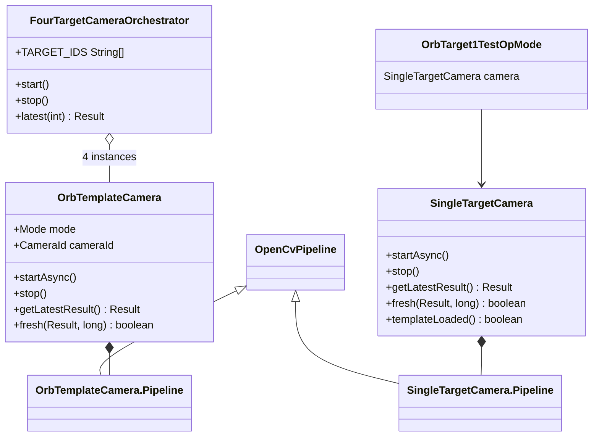

# Cấu trúc file — Thuật toán ORB (OpenCV) trong RoboconBN v3

**Cập nhật:** 2026-08-08  
**Phạm vi:** Toàn bộ source liên quan ORB template matching trên FTC EasyOpenCV  
**Trạng thái repo:** Phase 7 — camera/OpenCV continuation (ORB là pipeline chính cho vision)

---

## 1. Tóm tắt kiến trúc

Hệ thống vision ORB hiện tại gồm **hai implementation song song** cùng mục tiêu (nhận diện template bằng ORB + descriptor matching), nhưng khác mức độ hoàn thiện:

| Lớp | File | Mục đích | Độ chính |
|-----|------|----------|----------|
| **Production contract** | `OrbTemplateCamera.java` | Lifecycle webcam + ORB pipeline theo Phase 7 spec (2 mode, 2 webcam, policy constants) | Contract chính |
| **Production tracking** | `SingleTargetCamera.java` | ORB + **homography RANSAC** → tâm template thực; temporal hold | OpMode test hiện dùng |
| **Orchestrator** | `FourTargetCameraOrchestrator.java` | 4 instance `OrbTemplateCamera` (2 target/webcam1, 2 target/webcam2) | Multi-target |
| **Alternative (không ORB)** | `TemplateMatchCamera.java` | `matchTemplate` TM_CCOEFF_NORMED — benchmark/so sánh tốc độ | Không phải ORB |

**Luồng dữ liệu tổng quát:**

```
[target1.png] ──► load asset ──► Mat template
                                    │
webcam (FTC) ──► EasyOpenCV ──► processFrame(Mat)
                                    │
                    ┌───────────────┴───────────────┐
                    │ 1. RGBA/RGB → grayscale      │
                    │ 2. ROI center crop           │
                    │ 3. ORB detect + compute      │
                    │ 4. knnMatch + ratio test     │
                    │ 5. (optional) homography     │
                    │ 6. center + dx/dy vs frame   │
                    └───────────────┬───────────────┘
                                    │
                    AtomicReference<Result> ──► OpMode / orchestrator
```

---

## 2. Cây thư mục (file liên quan ORB)

```
RoboconBN v3/
├── build.dependencies.gradle          # FTC SDK 11.2.1 + Vision (OpenCV qua FTC stack)
├── TeamCode/
│   ├── build.gradle                   # task `cameraContinuationTest` → CameraContinuationTest
│   └── src/main/
│       ├── assets/
│       │   └── target1.png            # Template ảnh duy nhất đã commit (target1)
│       └── java/org/firstinspires/ftc/teamcode/
│           ├── core/                  # ★ Lõi thuật toán ORB
│           │   ├── OrbTemplateCamera.java      # Contract Phase 7 — ORB ratio-test only
│           │   ├── SingleTargetCamera.java     # ORB + RANSAC homography + temporal hold
│           │   ├── FourTargetCameraOrchestrator.java  # 4× OrbTemplateCamera
│           │   ├── TemplateMatchCamera.java    # (không ORB) template matching nhanh
│           │   ├── CameraChannel.java          # enum webcam1 / webcam2
│           │   └── CameraFrameContract.java    # Contract dx transport (chưa nối ORB)
│           ├── opmode/                # ★ OpMode kiểm thử trên robot
│           │   ├── OrbTarget1TestOpMode.java       # Dùng SingleTargetCamera + target1.png
│           │   └── TemplateMatchTarget1TestOpMode.java  # Dùng TemplateMatchCamera
│           └── test/                  # ★ Offline policy checks
│               ├── CameraContinuationTest.java     # Constants + policy assertions
│               └── MultiTargetCameraTest.java      # Filter temporal (chưa gắn ORB production)
└── .planning/phases/07-camera-opencv-continuation/
    ├── 07-CONTEXT.md                  # Locked decisions D-01…D-05 (ORB-only, shared lifecycle)
    ├── 07-RESEARCH.md                 # Architectural map + requirements VIS-01…VIS-07
    └── …                              # PLAN, SUMMARY, VALIDATION
```

**Không nằm trong ORB nhưng liên quan hardware:**

```
TeamCode/src/main/java/.../core/
├── RobotHardware.java                 # webcam1, webcam2 từ HardwareMap
└── CameraAdapterManager.java          # (nếu có) adapter transport — chưa wire ORB Result
```

---

## 3. Chi tiết từng file lõi

### 3.1 `OrbTemplateCamera.java`

**Đường dẫn:** `TeamCode/src/main/java/org/firstinspires/ftc/teamcode/core/OrbTemplateCamera.java`  
**Dòng:** ~82  
**Vai trò:** Một webcam + một template ORB bất biến; định nghĩa **contract chính** của Phase 7.

#### Enums & constants

| Symbol | Giá trị | Ý nghĩa |
|--------|---------|---------|
| `Mode.SINGLE_TARGET` | — | Centering authority (chỉ webcam1) |
| `Mode.MULTI_TARGET` | — | Classification, không authorize movement |
| `CameraId.WEBCAM1` / `WEBCAM2` | `webcam1` / `webcam2` | Map từ tên HardwareMap |
| `State` | CREATED → OPENING → STREAMING → STOPPING/CLOSED/ERROR | Lifecycle |
| `STREAM_WIDTH` / `HEIGHT` | 640 × 480 | Resolution stream |
| `MAX_FEATURES` | 300 | `ORB.create(nFeatures)` |
| `MAX_PYRAMID_LEVELS` | 4 | Pyramid ORB (scaleFactor 1.2) |
| `MAX_MATCHES` | 80 | Cap số cặp knnMatch xử lý |
| `MIN_MATCHES` | 8 | Số match tối thiểu để valid |
| `MAX_ROI_WIDTH` / `HEIGHT` | 480 × 360 | ROI center crop trước ORB |
| `MAX_RESULT_AGE_MS` | 300 | Freshness window |
| `MAX_FRAME_LATENCY_MS` | 100 | Budget processing cho authorize |
| `RATIO` | 0.75 | Lowe ratio test |
| `MIN_CONFIDENCE` | 0.35 | Ngưỡng confidence |

#### `Result` (immutable)

Trường public: `cameraId`, `mode`, `targetId`, `state`, `timestampMs`, `valid`, `authorizesMovement`, `centerX`, `centerY`, `dxPx`, `dyPx`, `confidence`, `processingMs`, `fps`.

- `authorizesMovement`: `valid && SINGLE_TARGET && WEBCAM1 && processingMs ≤ 100`
- **Lưu ý:** Trong pipeline hiện tại, khi valid thì `centerX/Y` = **tâm frame** (`input.cols()/2`, `input.rows()/2`) — **chưa** tính homography từ match (placeholder cho centering).

#### Constructor

```text
OrbTemplateCamera(HardwareMap, cameraName, preview, mode, targetId, Mat template)
```

- Validate: map, mode, targetId non-empty, template non-empty
- `SINGLE_TARGET` bắt buộc `webcam1`
- Tạo `OpenCvWebcam` (có/không preview `cameraMonitorViewId`)
- `Pipeline` precompute ORB trên template

#### Lifecycle methods

| Method | Mô tả |
|--------|-------|
| `startAsync()` | Idempotent; `openCameraDeviceAsync` → `startStreaming(640,480,UPRIGHT)` |
| `stop()` | Tăng `generation`, invalidate, stop stream, close, `pipeline.release()` |
| `getLatestResult()` | Đọc `AtomicReference`; reject nếu `result.state != camera.state` |
| `fresh(Result, now)` | STREAMING + valid + authorized + age ≤ 300ms + finite dx/dy |

#### Inner class `Pipeline extends OpenCvPipeline`

**Khởi tạo (một lần):**

1. Template → grayscale (`COLOR_RGBA2GRAY` hoặc `COLOR_RGB2GRAY`)
2. `orb.detect` + `orb.compute` → `templateKeys`, `templateDescriptors`
3. Throw nếu descriptors empty

**Mỗi frame (`processFrame`):**

1. Grayscale frame
2. ROI: submat center, max 480×360
3. `orb.detect(roi)` + `orb.compute` → keypoints + descriptors frame
4. Nếu `descriptors.rows() >= MIN_MATCHES`:
   - `matcher.knnMatch(templateDescriptors, descriptors, pairs, 2)` — BRUTEFORCE_HAMMING
   - Ratio test: `d0 < RATIO * d1`
   - `confidence = min(1, score/good)` với `score += 1/(1+distance)`
5. Valid nếu `good >= MIN_MATCHES` và `confidence >= MIN_CONFIDENCE`
6. Cập nhật `latest` Result; return input (không vẽ overlay)

**ORB instance:** `ORB.create(300, 1.2f, 4)` — có pyramid levels.

---

### 3.2 `SingleTargetCamera.java`

**Đường dẫn:** `TeamCode/src/main/java/org/firstinspires/ftc/teamcode/core/SingleTargetCamera.java`  
**Dòng:** ~108  
**Vai trò:** Implementation **đầy đủ hơn** cho single-target — homography + temporal hold. **OpMode `OrbTarget1TestOpMode` dùng class này**, không dùng `OrbTemplateCamera`.

#### Khác biệt so với `OrbTemplateCamera`

| Khía cạnh | `OrbTemplateCamera` | `SingleTargetCamera` |
|-----------|---------------------|----------------------|
| ORB pyramid | `create(300, 1.2f, 4)` | `create(300)` — default pyramid |
| Match → geometry | Chỉ ratio test; center = frame center | Ratio test → **findHomography RANSAC** → perspective transform 4 góc template |
| Temporal | Không hold | `TEMPORAL_HOLD_MS = 180` giữ result cũ khi miss ngắn |
| Asset loading | Cần `Mat` từ ngoài | `loadAsset(String)` từ `assets/` |
| `authorizesMovement` | Explicit trong Result | Không có field; dùng `fresh()` |
| Mode / multi-webcam | Có enum Mode, CameraId | Một webcam bất kỳ qua tên |

#### Constants bổ sung

| Symbol | Giá trị |
|--------|---------|
| `RANSAC_REPROJECTION` | 5.0 |
| `TEMPORAL_HOLD_MS` | 180 |

#### Pipeline geometry (sau ratio test)

1. Lấy `queryIdx` (template) / `trainIdx` (frame) từ good matches
2. Map train keypoint + ROI offset → điểm frame
3. `Calib3d.findHomography(src, dst, RANSAC, 5.0, mask)`
4. Inlier count → `confidence = min(1, inliers/count)`
5. Transform 4 góc template `(0,0)…(w,h)` → tâm = average 4 điểm
6. `dxPx = center.x - input.cols()/2`, `dyPx = center.y - input.rows()/2`

#### Asset loader

```text
loadAsset(assetName) → AppUtil.getDefContext().getAssets().open()
  → BitmapFactory → Utils.bitmapToMat → Mat RGBA
```

---

### 3.3 `FourTargetCameraOrchestrator.java`

**Đường dẫn:** `TeamCode/src/main/java/org/firstinspires/ftc/teamcode/core/FourTargetCameraOrchestrator.java`  
**Dòng:** ~29  

**Mapping 4 target:**

| Index | `TARGET_IDS` | Webcam | `OrbTemplateCamera.Mode` |
|-------|--------------|--------|---------------------------|
| 0 | `target1` | webcam1 | SINGLE_TARGET |
| 1 | `target2` | webcam1 | SINGLE_TARGET |
| 2 | `target3` | webcam2 | MULTI_TARGET |
| 3 | `target4` | webcam2 | MULTI_TARGET |

- Constructor: `Mat[] templates` length must be 4
- `start()` / `stop()` — loop 4 cameras
- `latest(index)` → `OrbTemplateCamera.Result`

**Hạn chế hiện tại:** Mỗi target = một `OrbTemplateCamera` instance riêng (một webcam physical per instance trong thiết kế hiện tại — **4 webcam bindings** nếu chạy đồng thời trên 2 physical cameras cần review hardware).

---

### 3.4 `TemplateMatchCamera.java` (không phải ORB)

**Đường dẫn:** `TeamCode/src/main/java/org/firstinspires/ftc/teamcode/core/TemplateMatchCamera.java`  

Dùng `Imgproc.matchTemplate` + `TM_CCOEFF_NORMED` trên ảnh downscale `SCALE=2`. Không dùng ORB/descriptor. Có vẽ circle overlay xanh trên frame. Dùng cho so sánh latency với ORB (`TemplateMatchTarget1TestOpMode`).

---

## 4. Lớp hỗ trợ & contract (chưa nối đầy đủ ORB)

### `CameraChannel.java`

```java
enum CameraChannel { WEBCAM1("webcam1"), WEBCAM2("webcam2"); }
```

### `CameraFrameContract.java`

Contract nhẹ: `channel`, `timestampNs`, `valid`, `dxPx` + `fresh()` / `authorizesMovement()`.  
**Chưa có adapter** chuyển `OrbTemplateCamera.Result` hoặc `SingleTargetCamera.Result` sang contract này trong production path.

### `RobotHardware.java`

```java
webcam1 = hardwareMap.get(WebcamName.class, "webcam1");
webcam2 = hardwareMap.get(WebcamName.class, "webcam2");
```

ORB cameras lookup `WebcamName` trực tiếp qua `HardwareMap`, không qua `RobotHardware` wrapper.

---

## 5. OpModes (integration / test trên robot)

### `OrbTarget1TestOpMode.java`

| Thuộc tính | Giá trị |
|------------|---------|
| TeleOp name | `"ORB Target 1 Test"` |
| Camera class | **`SingleTargetCamera`** (không phải OrbTemplateCamera) |
| Webcam | `webcam1` |
| Asset | `target1.png` |
| Preview | `true` |

Telemetry: state, valid, fresh, dx/dy, center, confidence, processing, fps, age, error.

### `TemplateMatchTarget1TestOpMode.java`

Cùng webcam + asset nhưng dùng `TemplateMatchCamera` — baseline non-ORB.

---

## 6. Tests offline

### `CameraContinuationTest.java`

**Chạy:** `./gradlew :TeamCode:cameraContinuationTest` (hoặc `main` trên compiled classes)

Kiểm tra **policy constants** (không chạy ORB trên ảnh thật):

- Stream 640×480, ORB bounds, match bounds, ROI, timing, ratio, confidence
- Enum distinctions (Mode, CameraId, State)
- `SingleTargetCamera` RANSAC bounds, temporal hold
- `FourTargetCameraOrchestrator.TARGET_IDS` length 4

### `MultiTargetCameraTest.java`

**Không test ORB.** Copy logic filter temporal (EMA, outlier, label hysteresis) cho multi-target — **chưa gắn** vào `OrbTemplateCamera` production.

---

## 7. Assets

| File | Đường dẫn | Dùng bởi |
|------|-----------|----------|
| `target1.png` | `TeamCode/src/main/assets/target1.png` | `OrbTarget1TestOpMode`, `TemplateMatchTarget1TestOpMode` |

**Chưa commit:** `target2.png`, `target3.png`, `target4.png` (orchestrator cần 4 `Mat` từ caller).

---

## 8. Dependencies & stack

| Thành phần | Nguồn | Ghi chú |
|------------|-------|---------|
| FTC SDK | `11.2.1` (`build.dependencies.gradle`) | `HardwareMap`, `WebcamName`, OpMode |
| FTC Vision | `org.firstinspires.ftc:Vision:11.2.1` | OpenCV bindings FTC |
| EasyOpenCV | `org.openftc.easyopencv.*` | `OpenCvWebcam`, `OpenCvPipeline` — import trong TeamCode |
| OpenCV Java | `org.opencv.*` | `ORB`, `DescriptorMatcher`, `Calib3d`, `Imgproc` |

EasyOpenCV không khai báo trực tiếp trong `build.dependencies.gradle`; được resolve qua `implementation project(':FtcRobotController')` và FTC build graph khi compile trên Android.

---

## 9. Sơ đồ class (ORB path)



---

## 10. Pipeline ORB chi tiết (bước thuật toán)

### 10.1 Precompute (constructor / Pipeline init)

```text
template Mat
    → cvtColor to GRAY (if needed)
    → ORB.detect(templateGray, templateKeys)
    → ORB.compute(templateGray, templateKeys, templateDescriptors)
    → release templateGray buffer
```

### 10.2 Per-frame (shared core)

```text
input Mat (RGBA từ camera)
    → gray Mat
    → ROI = center crop min(gray, MAX_ROI)
    → ORB.detect(roi, keys)
    → ORB.compute(roi, keys, descriptors)
    → knnMatch(templateDesc, desc, k=2)
    → for each pair: if d[0].distance < RATIO * d[1].distance → good match
```

### 10.3 Branch A — `OrbTemplateCamera` (geometry đơn giản)

```text
if good >= MIN_MATCHES:
    confidence = min(1, sum(1/(1+d)) / good)
    valid = confidence >= MIN_CONFIDENCE
    center = (frameWidth/2, frameHeight/2)   ← chưa homography
```

### 10.4 Branch B — `SingleTargetCamera` (geometry đầy đủ)

```text
if good >= MIN_MATCHES:
    build point correspondences (template kp ↔ frame kp + ROI offset)
    homography = findHomography(RANSAC, reprojThreshold=5)
    inliers = countNonZero(mask)
    confidence = min(1, inliers/count)
    if inliers >= MIN_MATCHES && confidence >= MIN_CONFIDENCE:
        transform template corners → center = centroid
        dx/dy vs frame center
    else: center = null
if center == null:
    if within TEMPORAL_HOLD_MS of last valid → keep held result
    else → invalid result
```

---

## 11. Phase 7 planning context (locked decisions)

Từ `07-CONTEXT.md` / `07-RESEARCH.md`:

- **D-01:** Tiếp tục lifecycle camera hiện có; ORB/template only — không tạo lifecycle class riêng.
- **D-02:** Một shared lifecycle + result contract cho cả SINGLE và MULTI mode → `OrbTemplateCamera`.
- **D-03:** Một instance = một template; 4 target = 4 instances; chỉ webcam1 có centering authority.
- **D-04:** Offline test = plain Java main, không JUnit.
- **D-05:** Idempotent start/stop, stale rejection, resource release.

**Gap so với spec:**

| Requirement | Trạng thái |
|-------------|------------|
| VIS-01 Shared two-mode API | `OrbTemplateCamera` có Mode — **geometry center chưa homography** |
| VIS-02–03 Left centering | `SingleTargetCamera` có homography — **OpMode dùng SingleTarget, không OrbTemplate** |
| VIS-04–05 Multi-target + duplicate suppression | Orchestrator có 4 instance — **chưa ranking/suppression trong code** |
| VIS-06–07 Policy constants | Có trong `OrbTemplateCamera` + `CameraContinuationTest` |
| TEST-01 Offline asset matching | `CameraContinuationTest` chỉ check constants — **chưa match ảnh fixture** |
| target2–4 assets | **Chưa commit** |

---

## 12. Ma trận “ai gọi ai”

| Caller | Callee | Ghi chú |
|--------|--------|---------|
| `OrbTarget1TestOpMode` | `SingleTargetCamera` | Production test path hiện tại |
| `TemplateMatchTarget1TestOpMode` | `TemplateMatchCamera` | Non-ORB baseline |
| `FourTargetCameraOrchestrator` | `OrbTemplateCamera` × 4 | Chưa có OpMode trong repo |
| `CameraContinuationTest` | static constants only | Gradle task `cameraContinuationTest` |
| `MultiTargetCameraTest` | filter copy only | Không gọi camera classes |
| Autonomous / lifting OpModes | — | **Chưa import ORB classes** |

---

## 13. Hằng số so sánh nhanh

| Constant | OrbTemplateCamera | SingleTargetCamera |
|----------|-------------------|---------------------|
| STREAM | 640×480 | 640×480 |
| MAX_FEATURES | 300 | 300 |
| Pyramid | 4 levels, scale 1.2 | default |
| MIN_MATCHES | 8 | 8 |
| MAX_MATCHES | 80 | 80 |
| MAX_ROI | 480×360 | 480×360 |
| RATIO | 0.75 | 0.75 |
| MIN_CONFIDENCE | 0.35 | 0.35 |
| MAX_RESULT_AGE_MS | 300 | 300 |
| MAX_FRAME_LATENCY_MS | 100 | 100 |
| TEMPORAL_HOLD_MS | — | 180 |
| RANSAC reproj | — | 5.0 |

---

## 14. Gợi ý đọc code theo thứ tự

1. `OrbTemplateCamera.java` — contract + constants + pipeline ORB cơ bản  
2. `SingleTargetCamera.java` — homography + temporal (implementation “đúng” hơn cho centering)  
3. `OrbTarget1TestOpMode.java` — cách dùng trên robot  
4. `FourTargetCameraOrchestrator.java` — multi-target layout  
5. `CameraContinuationTest.java` — policy được enforce  
6. `.planning/phases/07-camera-opencv-continuation/07-CONTEXT.md` — decisions locked  

---

## 15. File ngoài phạm vi ORB (đừng nhầm)

| File | Lý do |
|------|-------|
| `TemplateMatchCamera.java` | `matchTemplate`, không ORB |
| `MultiTargetCameraTest.java` | Temporal filter only |
| FTC samples `ConceptVisionColorLocator_*` | Color blob, không template ORB |
| `PlaceholderCameraTransport` | (nếu tồn tại) fail-closed stub — không ORB |

---

*Tài liệu này mô tả trạng thái source tại commit mapping; khi merge `SingleTargetCamera` geometry vào `OrbTemplateCamera` hoặc thêm assets target2–4, cập nhật mục 3, 7 và 11.*
